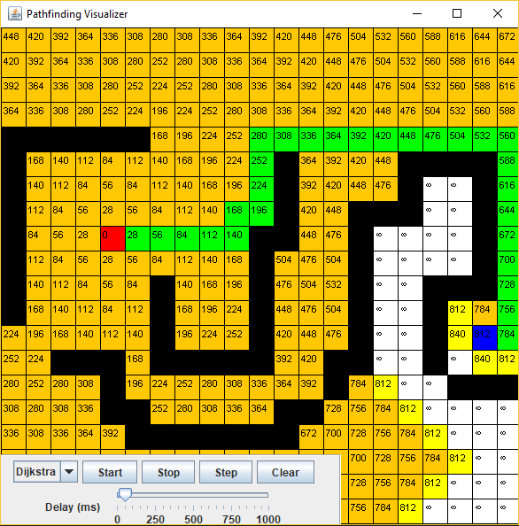

# pathfinding-visualizer
A Swing UI for visualizing pathfinding algorithms e.g. Dijkstra, A*.

Inspired by [this video](https://youtu.be/1-YPj5Vt0oQ) by Devon Crawford (Github repo [here](https://github.com/DevonCrawford/A-Pathfinding-Visualization)). I decided to try and reimplement this myself to learn both Swing and some pathfinding algorithms at the same time.

Dijkstra's algorithm in action:

